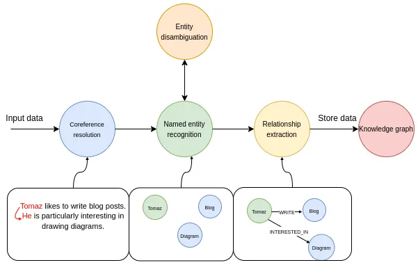

# Neo4j Setup

One storage solution for our RAG data is a Graph Database.  I have primarily used [Neo4j](https://neo4j.com/docs/).  The primariy benefit is building a **Knowledge Graph**

## Knowledge Graphs

A knowledge graph is a knowledge base that uses a graph-structured data model or topology to represent and operate on data. Knowledge graphs are often used to store interlinked descriptions of entities – objects, events, situations or abstract concepts – while also encoding the semantics or relationships underlying these entities

### Construction

TODO



Resources:
- [LlamaIndex Google Collab](https://colab.research.google.com/drive/1tLjOg2ZQuIClfuWrAC2LdiZHCov8oUbs#scrollTo=X45JFcoqqO_c)
- [Article: KG Creation using AI](https://bratanic-tomaz.medium.com/constructing-knowledge-graphs-from-text-using-openai-functions-096a6d010c17)
- [Article: Building Knowledge Graphs: REBEL, LlamaIndex, and REBEL + LlamaIndex](https://medium.com/@sauravjoshi23/building-knowledge-graphs-rebel-llamaindex-and-rebel-llamaindex-8769cf800115)

## Neo4j Setup

I had quite a few challenages when setting up Neo4j for the integration with LlamaIndex and specifically for storing the **vector** information that I generated using LlamaIndex.

In the end I was able to create a docker-compose file which would stand up a Neo4j instance which contained all of the required configuration for use with LlamaIndex:

```yaml
version: '3.7'

services:
  neo4j:
    container_name: knowledge-graph-neo4j
    image: neo4j:community
    volumes:
       - "./db-conf/plugins:/plugins"
       - ./data:/data
    ports:
      - 7474:7474
      - 7687:7687
    environment:
      - NEO4J_AUTH=none
      - NEO4J_apoc_export_file_enabled=true
      - NEO4J_apoc_import_file_enabled=true
      - NEO4J_apoc_import_file_use__neo4j__config=true
      - NEO4J_PLUGINS=["apoc"]
      - NEO4J_dbms.security.procedures.allowlist=apoc.meta.data
      - NEO4J_dbms_security_procedures_unrestricted=apoc.meta.data
```

## LlamaIndex Integration

- [LlamaIndex: KG with Neo4j Graph Store](https://docs.llamaindex.ai/en/stable/examples/index_structs/knowledge_graph/Neo4jKGIndexDemo.html)
- [LlamaIndex: Neo4j Graph Store](https://docs.llamaindex.ai/en/stable/examples/index_structs/knowledge_graph/Neo4jKGIndexDemo.html#building-the-knowledge-graph)
- [LlamaIndex: Neo4j Vector Store](https://docs.llamaindex.ai/en/stable/examples/vector_stores/Neo4jVectorDemo.html)